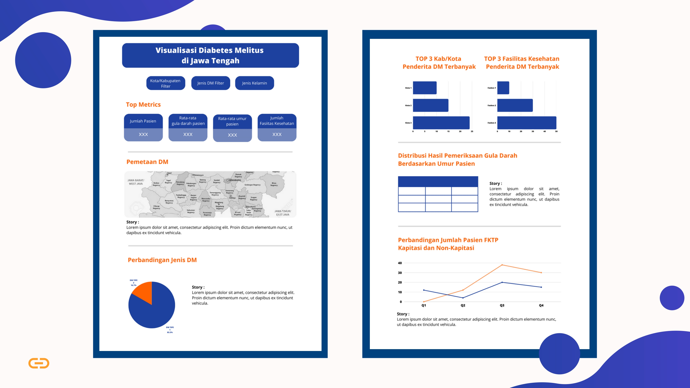

## 📊 Penerapan Model Klasifikasi Jenis Diabetes Melitus dalam Pengembangan Sistem Rekomendasi Penanganan Diabetes Melitus yang Efektif di Jawa Tengah
Dalam upaya meningkatkan penanganan diabetes melitus di Jawa Tengah, penelitian ini menerapkan model klasifikasi pada data BPJS Kesehatan untuk mengidentifikasi jenis diabetes pada pasien. Data kepesertaan, kunjungan medis, dan hasil pemeriksaan digunakan untuk mengklasifikasikan pasien ke dalam jenis diabetes yang sesuai. Berdasarkan hasil klasifikasi tersebut, sistem rekomendasi penanganan yang disesuaikan akan dikembangkan. Tujuannya adalah memberikan panduan pengobatan spesifik dan gaya hidup yang sesuai dengan jenis diabetes masingmasing pasien, dengan harapan meningkatkan efektivitas pengobatan dan mengurangi risiko komplikasi. Selain manfaat bagi pasien, pendekatan ini juga berpotensi untuk mengoptimalkan layanan kesehatan dengan pendekatan yang lebih personal dan efisien, serta berkontribusi pada pengambilan keputusan kebijakan yang lebih baik dalam manajemen penyakit kronis di wilayah tersebut.

## 🔥 Dashboard Mockup

## 🌟 Healthkathon-BPJS-HealInsights
|             Name            |      NIM       |
| --------------------------- | -------------- |
| Bima Rakajati               | A11.2020.13088 |
| Salsabila Putri Lesmarna    | A11.2020.12700 |
| Sella Rikha Yasmin          | A12.2020.06459 |